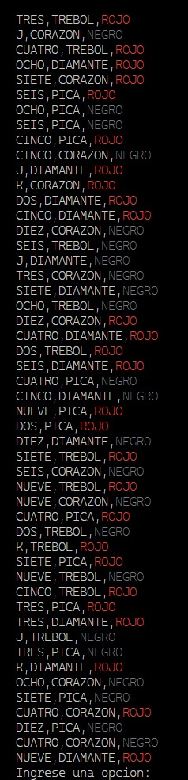

# Proyecto Cariocas
##### Lucas Ayala Casanova
##### David Gómez Pinto


---

# Sistema Actual

En la actualidad existe el juego en formato físico con sus cartas y sus reglas, en el cual se puede jugar hasta 4 jugadores en una mesa.

---

# Reglas

https://juegosdecartas10.com/juego-de-cartas-carioca/

---

# Sistema Propuesto

* Un sistema que permite realizar las operaciones básicas del juego.
* Sistema de Turnos.
* Objetivo por puntaje.
* Permite jugar 10 partidas con rondas de 2 trios y trio - escala.
* El juego debe está desarrollado en Python 3.

---

# Requerimientos Funcionales

- Tomar una carta de la baraja.
- Descartar una carta de su mano.
- Bajar una carta de su mano.
- Botar una carta de su mano.
- Ver las cartas de la baraja.
- Ver las cartas de la mesa.
- Ver las cartas de la pila de descartes.
- Ver las cartas de la pila de bajas.
- Ver las cartas de la pila de bajas de los demás jugadores

---

# Requerimientos No Funcionales

- Interfaz de linea de comandos.
- Persistencia **temporal** de puntaje. 

## Pseudorequerimientos:
- Desarrollar Sistema en Python 3. 

---


---


---

# Capturas de pantalla de la interfaz

---


---


---


---


---


---



---

```python

class Ronda:
    def __init__(self, trios: int, escalas: int) -> None:
        if trios <= 0 and escalas <= 0:
            raise ValueError(
                "Los valores de trios y escalas deben ser mayores a 0")
        self.trios = trios
        self.escalas = escalas

    def verificar_patrones(self, patrones: List[Cartas]) -> bool:
        trios = 0
        escalas = 0
        for patron in patrones:
            if self.es_trio(patron):
                trios += 1
            if self.es_escala(patron):
                escalas += 1
        return trios == self.trios and escalas == self.escalas

    @ staticmethod
    def es_trio(patron: Cartas) -> bool:
        if len(patron) != 3:
            return False
        for carta in patron:
            if carta.valor != patron[0].valor:
                return False
        return True

    @ staticmethod
    def es_escala(patron: list) -> bool:
        if len(patron) != 4:
            return False
        patron.sort(key=lambda carta: carta.valor)
        valor_actual = patron[0].valor
        for i in range(1, len(patron)):
            if patron[i].valor != valor_actual + 1:
                return False
            valor_actual = patron[i].valor
            if patron[i].pinta != patron[0].pinta:
                return False
        return True


Rondas = List[Ronda]

```

---

```python
class EventEmitter:
    """ Event emitter class
    Description: Esta clase permite emitir eventos y escucharlos. Util para la comunicacion entre modulos.
    Usage:
        from event import EventEmitter
        class MyClass(EventEmitter):
            def __init__(self):
                super().__init__()
            def myMethod(self):
                self.emit('myEvent', 'Hello World')
        myClass = MyClass()
        myClass.on('myEvent', lambda msg: print(msg))
    """

    def __init__(self):
        self._listeners = {}

    def emit(self, event, *args, **kwargs):
        for listener in self._listeners.get(event, ()):
            listener(*args, **kwargs)

    def on(self, event, listener):
        self._listeners.setdefault(event, []).append(listener)

    def once(self, event, listener):
        def onetime(*args, **kwargs):
            self.removeEvent(event, onetime)
            listener(*args, **kwargs)
        self.on(event, onetime)

    def removeEvent(self, event, listener):
        self._listeners.get(event, []).remove(listener)

    def removeAllEvents(self, event):
        if event:
            self._listeners[event] = []
        else:
            self._listeners = {}
```

---

En el caso de la clase anterior el uso está reservado a la comunicación entre objetos.

---
